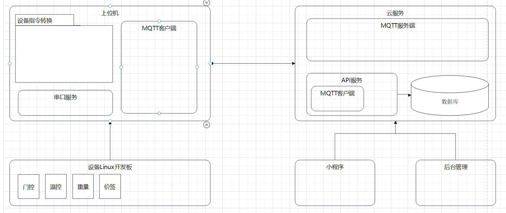

# 智能柜项目开发计划_23/1/31_v1.2

## 基于C#_.NET6开发部署

### 一阶段_23/2/1

#### 基于C#开发部署于Linux_ARM架构下上位机控制端

- 基于SerialPort开发多串口通信
  - 端口检测、开启/关闭、发送/接受
- 基于modbusRTU协议读写解析串口数据
  - 16进制字节数组转换、读写寄存器、解析响应数据
- 基于Log4Net日志记录系统
- 设备实例-设备协议指令转换
  - 配置表（后期维护）
  - 温控
    - 获取温度_设备是否异常
  - 门控
    - 门控状态_设备是否异常
    - 开启/关闭门锁
  - 价签
    - 获取显示_设备是否异常
    - 设置价签显示
  - 称重
    - 设备状态_设备是否异常
    - 重量检测
- 设备组合调试一、二、三。。。
- ~~基于MQTT协议构建客户端~~
  - ~~订阅、发布服务端~~
  - ~~接受发送Json数据~~

### 二阶段 基于C#开发部署MQTT服务端（云端）

- MQTT服务端，代理消息发布订阅
- API服务，权限认证管理，**业务服务**，支付等
  - Redis，设备锁定
  - 连接设备
  - 连接mqtt服务
- 数据库进行货柜信息持久化

### 三阶段 应用层

- 用户小程序
  - ~~MQTT服务器订阅，发布~~
    - ~~主题：货柜号/设备~~
  - 线下智能柜
  - ~~线上商城~~
  - 支付
  - 营销
  - 订单
  - 统计
- 商家配货小程序
  - ~~MQTT服务~~
  - 修改
  - 校准
  - 重置
  - 营销
  - 统计
- 后台管理
  - ~~MQTT服务~~
  - 数据库请求
  - 货柜信息管理
  - 权限管理
  - 营销管理
  - 统计

### 四阶段 测试试运行